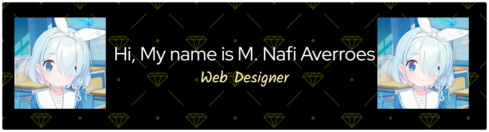

Hi  My name is Muhammad Nafi Averroes
===============================================================================================================================================

Web Developer
-------------

I've been learning code since 2023. Started with Java, but haven't really found a passion yet.

* 🌍  I'm based in I've been learning code since 2023. Started with Java, but haven't really found a passion yet.
* ✉️  You can contact me at [nafi.averroes@.gmail.com](mailto:nafi.averroes@.gmail.com)
* 💬  Ask me about i'm a gamer but not a truly gamer like the others.

### Socials

 <a href="https://www.github.com/Averroes098" target="_blank" rel="noreferrer"> <picture> <source media="(prefers-color-scheme: dark)" srcset="https://raw.githubusercontent.com/danielcranney/readme-generator/main/public/icons/socials/github-dark.svg" /> <source media="(prefers-color-scheme: light)" srcset="https://raw.githubusercontent.com/danielcranney/readme-generator/main/public/icons/socials/github.svg" />  </picture> </a> <a href="https://www.gitlab.com/Averroes098" target="_blank" rel="noreferrer"> <picture> <source media="(prefers-color-scheme: dark)" srcset="" /> <source media="(prefers-color-scheme: light)" srcset="https://raw.githubusercontent.com/danielcranney/readme-generator/main/public/icons/socials/gitlab.svg" />  </picture> </a> <a href="https://www.x.com/____Arthurzzzz____" target="_blank" rel="noreferrer"> <picture> <source media="(prefers-color-scheme: dark)" srcset="https://raw.githubusercontent.com/danielcranney/readme-generator/main/public/icons/socials/twitter-dark.svg" /> <source media="(prefers-color-scheme: light)" srcset="https://raw.githubusercontent.com/danielcranney/readme-generator/main/public/icons/socials/twitter.svg" />  </picture> </a> <a href="https://www.threads.net/@_arthurzzzz_" target="_blank" rel="noreferrer"> <picture> <source media="(prefers-color-scheme: dark)" srcset="https://raw.githubusercontent.com/danielcranney/readme-generator/main/public/icons/socials/threads-dark.svg" /> <source media="(prefers-color-scheme: light)" srcset="https://raw.githubusercontent.com/danielcranney/readme-generator/main/public/icons/socials/threads.svg" />  </picture> </a> <a href="https://www.linkedin.com/in/Muhammad Nafi Averroes" target="_blank" rel="noreferrer"> <picture> <source media="(prefers-color-scheme: dark)" srcset="https://raw.githubusercontent.com/danielcranney/readme-generator/main/public/icons/socials/linkedin-dark.svg" /> <source media="(prefers-color-scheme: light)" srcset="https://raw.githubusercontent.com/danielcranney/readme-generator/main/public/icons/socials/linkedin.svg" />  </picture> </a> <a href="https://www.twitch.tv/korekk_aapiii" target="_blank" rel="noreferrer"> <picture> <source media="(prefers-color-scheme: dark)" srcset="https://raw.githubusercontent.com/danielcranney/readme-generator/main/public/icons/socials/twitch-dark.svg" /> <source media="(prefers-color-scheme: light)" srcset="https://raw.githubusercontent.com/danielcranney/readme-generator/main/public/icons/socials/twitch.svg" />  </picture> </a> <a href="https://www.youtube.com/@ArthurzzzzYT" target="_blank" rel="noreferrer"> <picture> <source media="(prefers-color-scheme: dark)" srcset="https://raw.githubusercontent.com/danielcranney/readme-generator/main/public/icons/socials/youtube-dark.svg" /> <source media="(prefers-color-scheme: light)" srcset="https://raw.githubusercontent.com/danielcranney/readme-generator/main/public/icons/socials/youtube.svg" />  </picture> </a> <a href="https://discord.com/users/arthurzzzz." target="_blank" rel="noreferrer"> <picture> <source media="(prefers-color-scheme: dark)" srcset="https://raw.githubusercontent.com/danielcranney/readme-generator/main/public/icons/socials/discord-dark.svg" /> <source media="(prefers-color-scheme: light)" srcset="https://raw.githubusercontent.com/danielcranney/readme-generator/main/public/icons/socials/discord.svg" />  </picture> </a> <a href="https://www.facebook.com/Nafi Averroes" target="_blank" rel="noreferrer"> <picture> <source media="(prefers-color-scheme: dark)" srcset="https://raw.githubusercontent.com/danielcranney/readme-generator/main/public/icons/socials/facebook-dark.svg" /> <source media="(prefers-color-scheme: light)" srcset="https://raw.githubusercontent.com/danielcranney/readme-generator/main/public/icons/socials/facebook.svg" />  </picture> </a>

### Badges

## ⚡️ Stats

 

  
  
  

### Support Me

<ul style="list-style-type: none; margin: 0;">

<li style="display: inline-block; margin-right: 0.25rem;"></li>

<li style="display: inline-block; margin-right: 0.25rem;"></li>
                                                            

</ul>
ProfileMe.dev | Create an amazing GitHub profile in minutes
